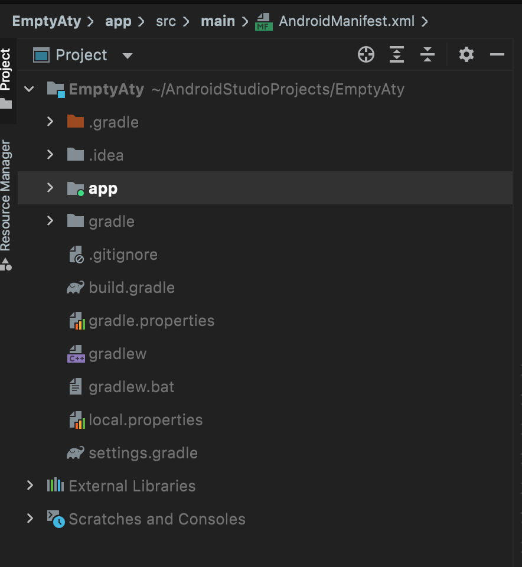
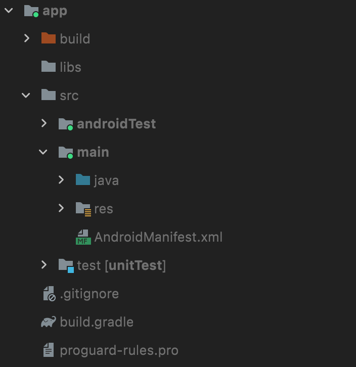

## Android应用程序组件

应用程序组件是一个Android应用程序的基本构建块。这些组件由应用清单文件松耦合的组织。 AndroidManifest.xml 描述了应用程序的每个组件，以及他们如何交互。四个主要组件为：

| 组件                | 描述                                      |
| :------------------ | :---------------------------------------- |
| Activities          | 描述UI，并且处理用户与机器屏幕的交互。    |
| Services            | 处理与应用程序关联的后台操作。            |
| Broadcast Receivers | 处理Android操作系统和应用程序之间的通信。 |
| Content Providers   | 处理数据和数据库管理方面的问题。          |

### 1.Activities

**一个活动标识一个具有用户界面的单一屏幕。** 如邮件应用程序可以包含一个活动用于显示新邮件列表，另一个活动用来编写邮件，再一个活动来阅读邮件。当应用程序拥有多于一个活动，其中的一个会被标记为当应用程序启动的时候显示。

一个活动是**Activity**类的一个子类，如下所示：

```java
public class MainActivity extends Activity {

}
```

### 2.Services

**服务是运行在后台，执行长时间操作的组件。** 举个例子，服务可以是用户在使用不同的程序时在后台播放音乐，或者在活动中通过网络获取数据但不阻塞用户交互。

一个服务是**Service**类的子类，如下所示：

```java
public class MyService extends Service {

}
```

### 3.Broadcast Receivers

广播接收器 **简单地响应从其他应用程序或者系统发来的广播消息** 。举个例子，应用程序可以发起广播来让其他应用程序知道一些数据已经被下载到设备，并且可以供他们使用。因此广播接收器会拦截这些通信并采取适当的行动。

广播接收器是**BroadcastReceiver**类的一个子类，每个消息以**Intent**对象的形式来广播。

```java
public class MyReceiver  extends  BroadcastReceiver {

}
```

### 4.Content Providers

内容提供者组件 **通过请求从一个应用程序到另一个应用程序提供数据** 。这些请求由**ContentResolver**类的方法来处理。这些数据可以是存储在文件系统、数据库或者其他其他地方。

内容提供者是**ContentProvider**类的子类，并实现一套标准的API，以便其他应用程序来执行事务。

```java
public class MyContentProvider extends  ContentProvider {

}
```

### 附件组件

有一些附件的组件用于以上提到的实体、他们之间逻辑、及他们之间连线的构造。这些组件如下：

| Fragments | 代表活动中的一个行为或者一部分用户界面。         |
| --------- | ------------------------------------------------ |
| Views     | 绘制在屏幕上的UI元素，包括按钮，列表等。         |
| Layouts   | 控制屏幕格式，展示视图外观的View的继承。         |
| Intents   | 组件间的消息连线。                               |
| Resources | 外部元素，例如字符串资源、常量资源及图片资源等。 |
| Manifest  | 应用程序的配置文件。                             |

---

## Android项目组成分析

### 1.整体结构



#### (1). .gradle和.idea

自动生成的文件，无需关心。

#### (2). app

包含了项目中的代码与资源，开发主要在这个目录下进行。

#### (3). build

编译时自动生成的文件。

#### (4).gradle

包含了gradle wrapper的配置文件，根据本地缓存的情况决定是否需要联网下载gradle。Android studio默认没有启动gradle wrapper的方式，如果需要打开，点击File->Settings->Build，Execution，Deplyment->Gradle，进行配置更改。

#### (5). .gitgnore

用于指定的目录或文件排除在版本控制之外的。

#### (6).build.gradle

项目全局的gradle构建脚本，通常这个文件中的内容不需要修改。

#### (7).gradle.properties

项目全局的gradle配置文件，其中配置的属性会影响项目中所有的gradle编译脚本。

#### (8).gradlew和gradlew.bat

这两个文件是用在命令行界面执行gradle命令的，前者在Linux或Mac系统，后者在Windows系统。

#### (9).local.properties

用于指定本机中Android SDK路径，通常内容是自动生成的，无需修改。

#### (10).settings.gradle

用于指定项目中所有引入的模块吗。由于项目中只有一个app模块，因此该文件之后也就只引入了app这一个模块。通常都是自动引入，无需手动修改。

> 可以看出，除了app目录外，其余基本都是自动生成，app目录下的内容才是重点。

### 2.app结构



#### (1).build

与外层build目录类似，也是主要包含编译时自动生成的文件，但内容更为复杂，无需过多关心。

#### (2).libs

存放使用的第三方jar包目录，存放后jar包会被自动添加至构建路径中。

#### (3).androidTest

用以编写Android Test测试用例，对项目进行一些自动化测试。

#### (4).java

放置所有Java代码的地方。

#### (5).res

存放项目中需要使用的所有图片、布局、字符串等资源。

+ 图片存放于drawable目录
+ 布局存放于layout目录
+ 字符串存放于values目录
+ 应用图标存放于以mipmap开头的目录

#### (6).AndroidManifest.xml

整个项目的配置文件，程序中定义的所有四大组件都需要在这个文件中注册。还可以在这个文件中给应用程序添加权限声明。

#### (7).test

用以编写Unit Test测试。

#### (8). .gitignore

用于将app模块内的指定的目录或文件排除在版本控制之外，作用域外层的 `.gitignore` 类似。

#### (9).build.gradle

app模块的gradle构建脚本，文件中会指定很多项目构建相关的配置。

#### (10).proguard-rules.pro

用于指定项目代码的混淆规则，当代码开发完成后打包文件，将代码进行混淆，保证安全性。

---

### 3.Android 运行流程分析

在 `AndroidManifest.xml` 文件中有：

```xml
<activity
  	android:name=".MainActivity"
    android:exported="true">
      <intent-filter>
          <action android:name="android.intent.action.MAIN" />
          <category android:name="android.intent.category.LAUNCHER" />
      </intent-filter>
</activity>
```

以上代码对 `MainActivity` 这个活动进行了注册，否则无法使用此活动。 `intent-filter` 这两行代码表示  `MainActivity` 是这个项目的主活动，在点击应用图标后，首先启动这个活动。

而在 `MainActivity.java` 这个文件中，有：

```java
public class MainActivity extends AppCompatActivity {

    @Override
    protected void onCreate(Bundle savedInstanceState) {
        super.onCreate(savedInstanceState);
        setContentView(R.layout.activity_main);
    }
}
```

其中 `MainActivity` 类继承自 `AppCompatActivity` ，类中有 `onCreate()` 方法，是在活动被创建时必定要执行的方法。

在 `onCreate()` 方法后调用了 `setContentView` 方法，给当前活动引入了一个 `activity_main` 布局，而最后显示的字符串就存在其中。

```xml
<TextView
          android:layout_width="wrap_content"
          android:layout_height="wrap_content"
          android:text="Hello World!"
          app:layout_constraintBottom_toBottomOf="parent"
          app:layout_constraintEnd_toEndOf="parent"
          app:layout_constraintStart_toStartOf="parent"
          app:layout_constraintTop_toTopOf="parent" />
```

### 4.详解build.gradle文件

>  Android Studio采用Gradle来构建项目。

首先查看外层的 `bulid.gradle` 文件：

```gradle
plugins {
    id 'com.android.application' version '7.2.1' apply false
    id 'com.android.library' version '7.2.1' apply false
}

task clean(type: Delete) {
    delete rootProject.buildDir
}
```


app 目录下的 `bulid.gradle` 文件：

```
android {
    compileSdk 32

    defaultConfig {
        applicationId "com.example.emptyaty"
        minSdk 21
        targetSdk 32
        versionCode 1
        versionName "1.0"

        testInstrumentationRunner "androidx.test.runner.AndroidJUnitRunner"
    }

    buildTypes {
        release {
            minifyEnabled false
            proguardFiles getDefaultProguardFile('proguard-android-optimize.txt'), 'proguard-rules.pro'
        }
    }
    compileOptions {
        sourceCompatibility JavaVersion.VERSION_1_8
        targetCompatibility JavaVersion.VERSION_1_8
    }
}

dependencies {
    implementation 'androidx.appcompat:appcompat:1.3.0'
    implementation 'com.google.android.material:material:1.4.0'
    implementation 'androidx.constraintlayout:constraintlayout:2.0.4'
    testImplementation 'junit:junit:4.13.2'
    androidTestImplementation 'androidx.test.ext:junit:1.1.3'
    androidTestImplementation 'androidx.test.espresso:espresso-core:3.4.0'
}
```

---


## Android 日志工具

Android中的日志工具类是Log(android.util.Log)，提供了如下5个方法打印日志。

+ `Log.v()` 。打印最为琐碎、意义最小的日志信息。对于级别为verbose，级别最低。
+ `Log.d()` 。打印调试信息。对于级别为debug，比verbose高一级。
+ `Log.i()` 。打印比较重要的数据。对应级别为 info，比debug高一级。
+ `Log.w()` 。打印警告信息。提升程序有潜在风险，对应级别为warn，比info高一级。
+ `Log.e()` 。打印错误信息。对应级别为error，比warn高一级。

> 一定不要用 `system.out.println()` 方法打印日志。。


