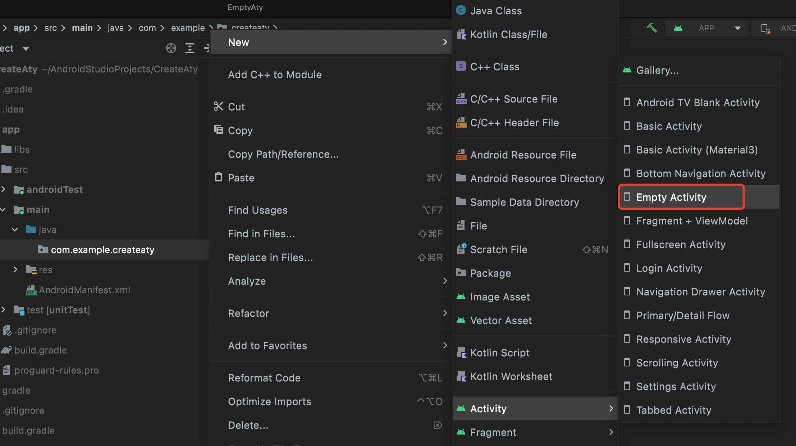
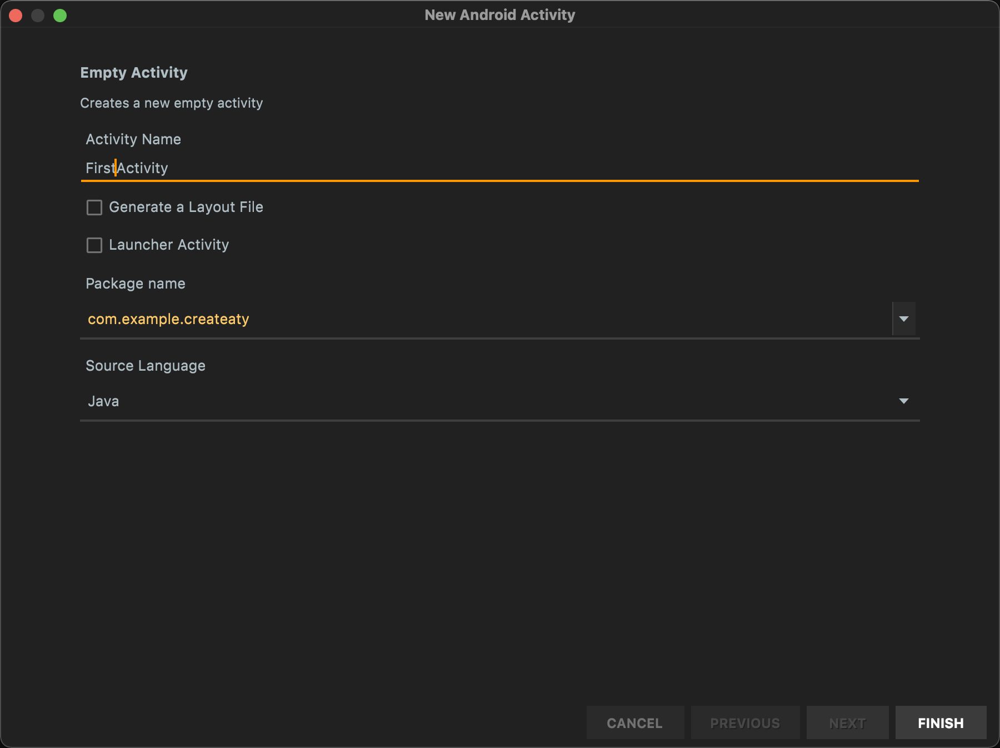
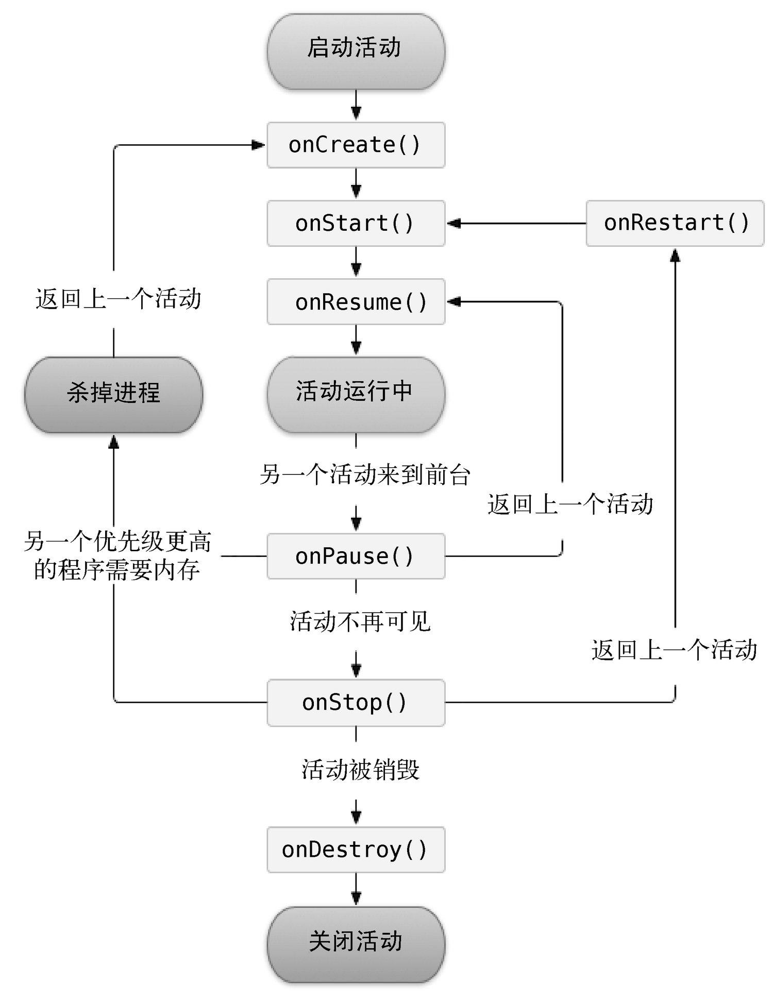
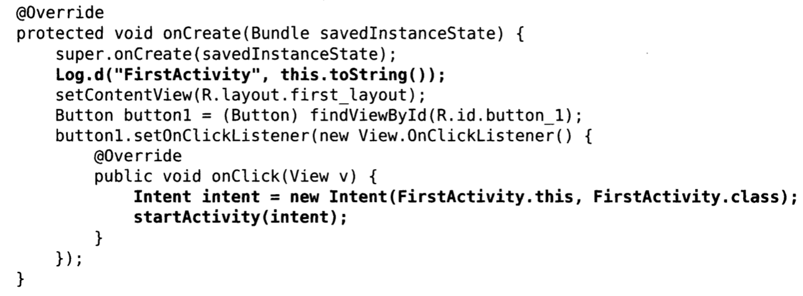
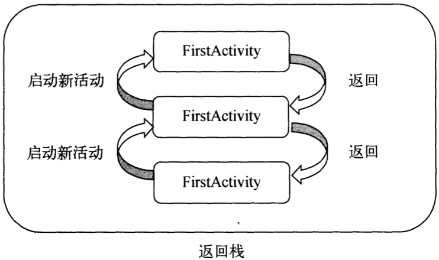
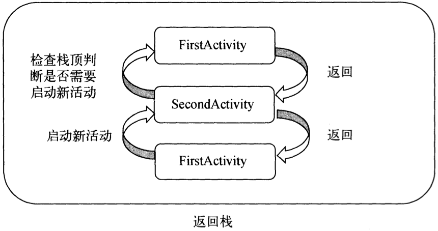
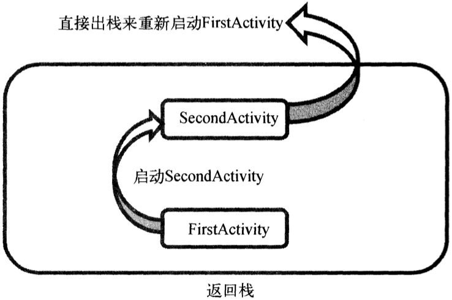
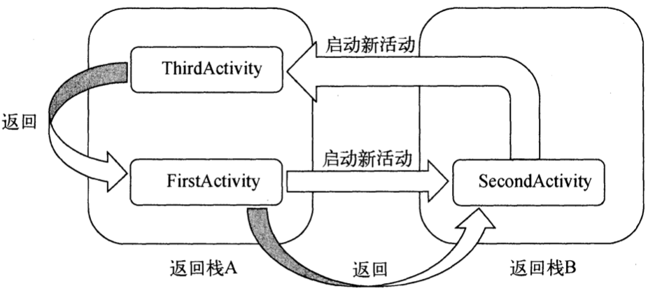
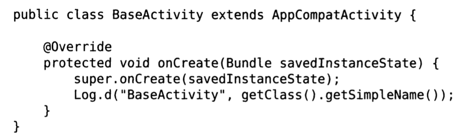

### 1.活动及其用法

**活动用于标识一个具有用户界面的单一屏幕。**  可以包含用户界面的组件，用于和用户进行交互。

#### (1).手动创建活动

+ 创建No Activity项目，命名为 `CreateAty` 。随后创建一个 Empty Activity，命名为 `FirstActivity` 



+ 创建时不要勾选 `Generate a Layout File` 和 `Launcher Activity` 这两个选项
  +  `Generate a Layout File` 表示自动为 `FirstActivity` 创建一个对应的布局文件。
  + `Launcher Activity`  表示自动将  `FirstActivity` 设置为当前项目的主活动。



#### (2). 创建和加载布局

+ 在 `app/src/main/res` 目录下新建 Directory，命名为 `layout` ，随后创建 `Layout resource file` 文件，命名为 `first_layout` ，根元素设置为 	`LinearLayout` ，如下图所示。


+ 随后在 `layout` 文件中添加一个 `Button ` 元素：

```xml
<Button
        android:layout_width="match_parent"
        android:layout_height="wrap_content"
        android:id="@+id/button_1"	
        android:text="Button 1" 
/>
```

>  `android:id` 是唯一标识符， `@+id` 表示在XML中对应一个id

+ 在 `FirstActivity` 类的 `onCreate()` 方法中添加方法加载布局：

```java
public class FirstActivity extends AppCompatActivity {

    @Override
    protected void onCreate(Bundle savedInstanceState) {
        super.onCreate(savedInstanceState);
      	//向 setContentView 传入布局文件的id
      	//只需调用 R.layout.first_layout 就可以得到 first_layout.xml 布局的id，传入函数中
        setContentView(R.layout.first_layout);
    }
}
```

#### (3). 在AndroidManifest文件中注册

> 所有活动都需要在 `AndroidManifest.xml` 中注册才能生效，Android studio默认会自动注册

```xml
<application
        android:allowBackup="true"
        android:dataExtractionRules="@xml/data_extraction_rules"
        android:fullBackupContent="@xml/backup_rules"
        android:icon="@mipmap/ic_launcher"
        android:label="@string/app_name"
        android:roundIcon="@mipmap/ic_launcher_round"
        android:supportsRtl="true"
        android:theme="@style/Theme.CreateAty"
        tools:targetApi="31">
        <activity
            android:name=".FirstActivity"
            android:exported="true" 
        />
</application>
```

+ 活动的声明放在 `<application>` 标签中，并通过 `<activity>` 标签进行对活动的注册。

  +  `android:name` 指定了具体注册哪一个活动， `.FirstActivity` 指的是 `com.example.createaty.FirstActivity` 的缩写，上面 `package` 属性已经指明。

+  **继续为程序配置活动** ，在 `<activity>` 标签中加入 `<intent-filter>` 标签，并加入

  ```xml
  <activity
              android:name=".FirstActivity"
              android:exported="true"
              android:label="This is FirstActivity">
              <intent-filter>
                  <action android:name="android.intent.action.MAIN" />
                  <category android:name="android.intent.category.LAUNCHER" />
              </intent-filter>
  </activity>
  ```

  **这样程序就知道首先启动哪个活动。**

#### (4).在活动中使用Toast

> Toast是Android系统中提供的一种提醒方式，以一些短小的信息通知给用户，一段时间后自动消失。

+ 定义一个弹出Toast的触发点，在点击按钮是进行触发：

```java
protected void onCreate(Bundle savedInstanceState) {
    super.onCreate(savedInstanceState);
    setContentView(R.layout.first_layout);

    Button button1 = (Button) findViewById(R.id.button_1);
    button1.setOnClickListener(new View.OnClickListener() {
        @Override
        public void onClick(View view) {
            Toast.makeText(FirstActivity.this, "You clicked Button1",Toast.LENGTH_SHORT).show();
        }
    });
}
```

> 1. 通过 `findViewById()` 方法获取到在布局文件中定义的元素，程序中传入 `R.id.button_1` ，得到按钮的实例。
> 2.  `findViewById()` 方法返回一个 `View` 对象，需要向下转成 `Button` 对象
> 3. 得到实例后，通过调用 `setOnClickListener()` 方法为按钮注册一个监听器，点击按钮时就会执行监听器中的 `onClick()` 方法。将 Toast 功能在 `onClick()` 方法中编写。
> 4. Toast 通过静态方法 `makeText()` 创建出 Toast 对象，然后调用 `show()` 方法将 Toast 显示出来即可。 `makeText()` 需要传入三个参数：
>    + 第一个参数为： Context，即 Toast 要求的上下文，由于活动本身是 Context 对象，直接传入 `FirstActivity.this`
>    + 第二个参数为： Toast 文本内容。
>    + 第三个参数为： Toast显示的时长


#### (5).销毁一个活动

> Activity类提供了` finish()` 方法来销毁当前活动。

```java
button1.setOnClickListener(new View.OnClickListener() {
    @Override
    public void onClick(View view) {
        finish();
    }
});
```

---


### 2.Intent用法

Intent 是Android程序中各组件之间进行交互的重要方式，不仅可以指明当前组件想要执行的动作，还可以在不同组件之间传递数据。一般可被用于启动活动、启动服务以及发送广播等场景。可以分为 **显式intent** 和 **隐式 Intent** 。

#### (1).显式 Intent

+ 新建一个 `Empty Activity`，命名为 `SecondActivity` ，勾选 `Generate Layout File` ，不要勾选 `Launcher Activity` 。
+ 创建后，在 `layout` 中创建 `Button2` 组件， `id` 设置为 `button_2` 。
+ `AndroidManifest.xml` 文件中默认配置了 `SecondActivity` 相关内容。
+ 利用 `Intent` 将两个 `Activity` 相联系。

```java
button1.setOnClickListener(new View.OnClickListener() {
    @Override
    public void onClick(View view) {
        Intent intent = new Intent(FirstActivity.this, SecondActivity.class);
        startActivity(intent);
    }
});
```

+  `Intent` 有多个构造函数的重载，其中一个为 `Intent(Context packageContext, Class<?> cls)` ，而 `Activity` 类提供了 `startActivity()` 方法启动活动，可以接收 `Intent` 参数。
  + 第一个参数 `Context` 要求提供一个启动活动的上下文
  + 第二个参数 `Class` 则是指定想要启动的目标活动
+ 将 `FirstActivity.this `作为上下文参数， `SecondActivity.class` 作为目标活动，即在 `FirstActivity` 活动的基础上打开 `SecondActivity` 活动；然后通过 `startActivity()` 方法执行这个 `Intent` 。

> 由于 `Intent`  的意图非常明显，因此称之为 **显示 Intent** 。

####  (2).隐式 Intent

> 相比于显式 `Intent` ，隐式 `Intent` 则含蓄很多，并不指明想要启动的活动，而是指定一系列更为抽象的 `action` 和 `category` 等信息，然后交由系统去分析这个 `Intent` ，并找到合适的  `Activity` 去启动 。

+ 首先在 `AndroidManifest.xml` 中 `.SecondActivity` 进行配置 `<intent-filter>` 内容：

```xml
<activity
            android:name=".SecondActivity"
            android:exported="true" >
            <intent-filter>
                <action android:name="com.example.createaty.ACTION_START" />
                <category android:name="android.intent.category.DEFAULT" />
              	<category android:name="android.intent.category.MY_CATEGORY" />
            </intent-filter>
</activity>
```

+ 当 `<action>` 与 `<category>` 中的内容同时匹配时能够匹配上 `Intent` 中指定的 `action` 与 `category` 时，`Activity` 会响应该 `Intent` 。

```java
button1.setOnClickListener(new View.OnClickListener() {
    @Override
    public void onClick(View view) {
        Intent intent = new Intent("com.example.createaty.ACTION_START");
      	intent.addCategory("android.intent.category.MY_CATEGORY");
        startActivity(intent);
    }
});
```


#### (3).向下一个活动传递数据

> `Intent` 中提供了一系列 `putExtra()` 方法的重载，可以把想要传递的数据暂存在 `Intent` 中，启动另一个活动时，只需把这些数据再从 `Intent` 中取出即可。

+ 首先利用显式 `Intent` 启动 `SecondActivity` ，通过 `putExtra()` 方法传递字符串，其中 `putExtra()` 方法接受两个参数：
  + 第一个为键，用于后面从 `Intent`取值
  + 第二个为传递的数据

+  将 `FirstActivity` 中的字符串传到 `SecondActivity` 中：

```java
button1.setOnClickListener(new View.OnClickListener() {
    @Override
    public void onClick(View view) {
        Intent intent = new Intent(FirstActivity.this, SecondActivity.class);
        intent.putExtra("extra_data","This is a word!");
        startActivity(intent);
    }
});
```

+ `SecondActivity` 通过 `getIntent()` 方法获取到用于启动 `SecondActivity` 的 `Intent` ，然后利用 `getStringExtra()` 方法，传入相应的键值，获取传递的数据：

```java
public class SecondActivity extends AppCompatActivity {

    @Override
    protected void onCreate(Bundle savedInstanceState) {
        super.onCreate(savedInstanceState);
        setContentView(R.layout.activity_second);

        Intent intent =  getIntent();
        String data = intent.getStringExtra("extra_data");
        Log.d("SecondActivity",data);
    }
}
```

#### (4).返回数据给上一个活动

> `Activity` 中 `startActivityForResult()` 方法也是用于启动活动的，这个方法期望在活动销毁时返回一个结果给上一个活动。这就是所需要的功能。

+ `startActivityForResult()` 方法接收两个参数：
  + 第一个参数还是 `Intent`
  + 第二个参数是请求码，用于之后回调中判断数据的来源。
+ 首先修改 `FirstActivity` 中的按钮点击事件：

```java
Button button1 = (Button) findViewById(R.id.button_1);
button1.setOnClickListener(new View.OnClickListener() {
    @Override
    public void onClick(View view) {
        Intent intent = new Intent(FirstActivity.this, SecondActivity.class);
        startActivityForResult(intent, 1);
    }
});
```

> 使用 `startActivityForResult` 方法启动 `SecondActivity` ，请求码只要是唯一值即可，这里设置为1。

+ 在 `SecondActivity` 中给按钮注册点击事件，并在其中添加返回数据的逻辑。
+  `setResult()` 方法专门用于向上一个活动返回数据。接收两个参数：
  + 第一个参数用于向上一个活动返回处理结果，一般是 `RESULT_OK` 或 `RESULT_CANCELED` 。
  + 第二个参数则将 `intent` 传递回去。

```java
Button button = (Button) findViewById(R.id.button_2);
button.setOnClickListener(new View.OnClickListener() {
    @Override
    public void onClick(View view) {
        Intent intent = new Intent();
        intent.putExtra("data_return", "This is a return word");
        setResult(RESULT_OK, intent);
        finish();
    }
});
```

> 这里构建 `Intent` 只是为了传递数据。随后将数据存放至 `Intent` 中，随后调用 `setResult()` 方法。 

+  由于使用 `startActivityForResult()` 方法启动 `SecondActivity` ，在 `SecondActivity` 被销毁后会调用上一个活动的 `onActivityResult()` 方法，因此需要再 `FirstActivity `中重写这个方法来回获取数据。
+  `onActivityResult()` 方法有三个参数，通过这三个参数来筛选出传回的数据。
  +  `requestCode` 为启动时传入的请求码
  +  `resultCode` 为返回数据时传入的处理结果
  +  `data` 为携带的数据

```java
@Override
protected void onActivityResult(int requestCode, int resultCode, Intent data) {
    super.onActivityResult(requestCode, resultCode, data);
    switch (requestCode) {
        case 1:
            if (resultCode == RESULT_OK) {
                String returnedData = data.getStringExtra("data_return");
                Log.d("FirstActivity", returnedData);
            }
            break;
        default:
    }
}
```

---

### 3.活动的生命周期

Android是使用任务（Task）来管理活动的，一个任务就是存放在栈里的活动的集合，栈也称为返回栈（Back Stack）。

在默认情况下，每当启动一个新的活动，它会在返回栈中入栈，并处于栈顶的位置。每当按下Back键或者调用 `finish()` 方法去销毁一个活动，处于栈顶的活动会出栈，前一个入栈的活动会重新处于栈顶的位置。系统总是显示处于栈顶的活动给用户。

#### (1).活动状态

> 每个活动在其生命周期中最多可能会有4种状态。

+  **运行状态**

当活动位于返回栈的栈顶时，表示活动处于运行状态。系统最不愿意回收此状态的活动，因为会带来不好的用户体验。

+  **暂停状态**

当活动不再处于栈顶位置，但仍然可见时，表示活动进入暂停状态。比如对话框形式的活动只会占用屏幕中间的部分区域，处于暂停暂停状态的活动仍然是完全存活着的。

+  **停止状态**

当活动不再处于栈顶位置，而且完全不可见的时候，就进入了停止状态。系统仍然会为这种活动保存相应的状态和成员变量，但是并不完全可靠，其他地方需要内存时，处于停止状态的活动可能会被系统回收。

+  **销毁状态**

当活动从返回栈中移除后就会变成销毁状态。系统会倾向于回收处于这种状态的活动，从而保证手机内存充足。

#### (2).活动生命周期简介

`Activity` 类中定义了七种回调方法，覆盖了生命周期的每一个环节。

+  `onCreate()` 方法

在活动第一次创建时调用，在这个方法中完成活动的初始化操作，如加载布局、绑定事件等。

+  `onStart()` 方法

在活动由不可见变为可见的时候调用。

+  `onResume()` 方法

在活动准备好和用户进行交互的时候调用。此时活动一定位于返回栈的栈顶，并且处于运行状态。

+  `onPause()` 方法

在系统准备去启动或者恢复另一个活动的时候调用。通常会在这个方法中将一些消耗CPU的资源释放掉，保存一些关键数据，但这个方法的执行速度一定要快，不然会影响到新的栈顶活动的使用。

+  `onStop()` 方法

在活动完全不可见的时候调用。与 `onPause()` 方法主要区别在于，如果启动的新活动是一个对话框式的活动，那么 `onPause()` 方法会得到执行，而 `onStop()` 方法并不会执行。

+  `onDestory()` 方法

在活动被销毁之前调用，之后活动的状态将变为销毁状态。

+  `onRestart()` 方法

在活动由停止状态变为运行状态之前调用，也就是活动被重新启动。



以上七个方法除了 `onRestart()` 方法外，其他都是两两相对的，从而可以将活动分为3种生存期。

+  **完整生存期**

活动在 `onCreate()` 方法和 `onDestroy()` 方法之间所经历的，就是完整生存期。

一般情况下，一个活动在 `onCreate()` 方法中完成各种初始化操作，在 `onDestroy()` 方法中完成释放内存的操作。

+  **可见生存期**

活动在 `onStart()` 方法和 `onStop()` 方法之间所经历的，就是可见生存期。在可见生存期内，活动对于用户总是可见的，通过这两个方法，可以合理的管理那些对用户可见的资源。

比如在 `onStart()` 方法中对资源进行加载，在 `onStop()` 方法中对资源进行释放，从而保证处于停止状态的活动不会占用过多内存。

+  **前台生存期**

活动在 `onResume()` 方法和 `onPause()` 方法之间所经历的就是前台生存期。

在前台生存期内，活动总是处于运行状态，此时的活动可以与用户进行交互，平时接触最多的也是这个状态下的活动。

#### (3).活动生命周期体验

创建连个活动 `FirstActivity` 与 `SecondActivity` ，在 `FirstActivity` 中开启 `SecondActivity` ，并重写七个生命周期函数，则会有：

```bash
FirstActivity onCreate
FirstActivity onStart
FirstActivity onResume
FirstActivity onPause
# 打开SecondActivity
SecondActivity onCreate
SecondActivity onStart
SecondActivity onResume
# 此时SecondActivity完全覆盖了FirstActivity
FirstActivity onStop
```

如果活动SecondActivity没有完全覆盖FirstActivity

```bash
FirstActivity onCreate
FirstActivity onStart
FirstActivity onResume
FirstActivity onPause
# 打开SecondActivity
SecondActivity onCreate
SecondActivity onStart
SecondActivity onResume
# 此时SecondActivity没有完全覆盖了FirstActivity
# 点击空白处，退出SecondActivity
SecondActivity onPause
FirstActivity onResume #重新出现
SecondActivity onStop
SecondActivity onDestory #完全销毁
```

---

### 4.活动的启动模式

在实际项目中应该根据特定的需求为每个活动指定恰当的启动模式。启动模式一共有四种，分别为： `standard` 、 `singleTop` 、 `singleTask` 、 `singleInstance` ，可以在 `AndroidManifest.xml` 中通过给 `<activity>` 标签指定 `android:launchMode` 属性来选择启动的模式。

#### (1).standard

 `standard` 是活动默认的启动模式，在此模式下，每当启动一个新活动，会在返回栈中入栈，并处于栈顶位置。对于  `standard` 模式的活动，系统不会在乎这个活动是否已经在返回栈中存在，每次启动都会创建该活动的一个新实例。



上述代码中，会在 `FirstActivity` 的基础上启动 `FirstActivity` ，如果连续通过按钮创建三个 `FirstActivity` 实例，则需要连按三次 Back 键才能退回程序。原理示意图如下图所示：



#### (2).singleTop

 `singleTop` 模式下，启动活动时如果发现返回栈的栈顶已经是该活动，则直接使用，不会再创建新的活动实例。 

```xml
 <activity
            android:name=".FirstActivity"
            android:launchMode="singleTop"
           
            <intent-filter>
                <action android:name="android.intent.action.MAIN" />
                <category android:name="android.intent.category.LAUNCHER" />
            </intent-filter>
</activity>
```

但是如果从 `FirstActivity ` 活动中启动 `SecondActivity` ，然后再从 `SecondActivity` 中启动  `FirstActivity ` ，此时这两个 `FirstActivity ` 实例是不同的。原理示意图如下图所示：



#### (3).singleTask

  `singleTask` 模式下，启动活动时系统首先会在返回栈中检查是否存在该活动的实例，

+ 如果发现已经存在则直接使用该实例，并把在这个活动之上的所有活动全部出栈；
+ 如果不存在该活动的实例，则创建一个新的活动实例。

```xml
 <activity
            android:name=".FirstActivity"
            android:launchMode="singleTask"
           
            <intent-filter>
                <action android:name="android.intent.action.MAIN" />
                <category android:name="android.intent.category.LAUNCHER" />
            </intent-filter>
</activity>
```

但是如果从 `FirstActivity ` 活动中启动 `SecondActivity` ，然后再从 `SecondActivity` 中启动  `FirstActivity ` ，则 `SecondActivity` 会从返回栈中出栈， `FirstActivity ` 重新成为栈顶活动，因此  `FirstActivity `  的 `onRestart()` 方法和 `SecondActivity` 的 `onDestroy()` 方法会得到执行。



#### (4).singleInstance

  `singleInstance` 模式下活动会启动一个新的返回栈来管理这个活动。当程序中有一个活动是允许其他进程调用的，如果想要实现其他程序和这个程序可以共享这个活动的实例，则可以使用 `singleTask` 模式进行实现。

```xml
 <activity
            android:name=".SecondActivity"
            android:launchMode="singleInstance"
           
            <intent-filter>
                <action android:name="android.intent.action.MAIN" />
                <category android:name="android.intent.category.LAUNCHER" />
            </intent-filter>
</activity>
```

但是如果从 `FirstActivity ` 活动中启动 `SecondActivity` ，然后再从 `SecondActivity` 中启动  `ThirdActivity ` ，如果利用 `getTaskId()` 方法来获取栈 Id 的话，会发现 `SecondActivity` 与另外两个不同。

当利用 Back 键返回时，  `ThirdActivity ` 会直接返回到 `FirstActivity ` ，再按下 Back 键又会返回到 `SecondActivity` ，再按下 Back 键才会退出程序，原理如下图所示：



---

### 5.活动的最佳实践

#### (1).知晓当前活动

+ 通过创建新的Java类 `BaseActivity` ，继承自 `AppCompatActivity` ，在 `onCreate()` 方法中获取当前实例的类名。
+ 之后所有的活动都继承自 `BaseActivity` ，则进入活动时会自动打印实例的类名。



#### (2).随时退出程序

如果程序需要一个注销或者退出的功能，可以用一个专门的集合类对所有的活动进行管理。

```java
public class ActivityCollector {
    public static List<Activity> activities = new ArrayList<Activity>();
  
    public static void addActivity(Activity activity){
        activities.add(activity);
    }
  
    public static void removeActivity(Activity activity){
        activities.remove(activity);
    }
  
    public static void finishAll(){
        for (Activity activity: activities) {
            if (!activity.isFinishing()){
                activity.finish();
            }
        }
    }
};
```

> 在活动管理器中，通过一个 List 来暂存活动，然后提供了一个 `addActivity()` 方法用于向 List 中添加一个活动，提供 `removeActivity()` 活动从 List 中移除活动，最后提供了 `finishAll()` 方法用于将 List 中存储的活动全部销毁。

下面修改 `BaseActivity` 中的代码：

```java
public class BaseActivity  extends Activity {
    @Override
    protected void onCreate(Bundle savedInstanceState){
        super.onCreate(savedInstanceState);
        Log.d("BaseActivity", getClass().getSimpleName());
        ActivityCollector.addActivity(this);
    }
  
    @Override
    public void onDestroy(){
        super.onDestroy();
        ActivityCollector.removeActivity(this);
    }
}
```

+ 这样在  `BaseActivity` 类中 `onCreate()` 方法中调用了 `ActivityCollector` 的 `addActivity` 方法，将当前正在创建的活动添加到活动管理器中。

+ 然后在  `BaseActivity` 类中重写了 `onDestroy()` 方法，调用了 `ActivityCollector` 的 `removeActivity` 方法，将马上要销毁的活动从活动管理器中移除。
+ 最后，如果想在什么地方退出程序，只需调用 `ActivityCollector.finishAll()` 方法即可。

#### (3).启动活动最佳写法

>  启动活动方法一般都是通过 `Intent` 构建出当前的意图，然后调用 `startActivity()` 或 `startActivityForResult()` 方法将活动启动起来，如果有数据需要从一个活动传递到另一个活动,也可以借助 `Intent` 来完成。

假设 `SecondActivity` 中需要用两个非常重要的字符串参数， 在启动 `SecondActivity` 的时候必须要传递过来，一般写法如下：

```java
Intent intent = new   Intent(FirstActivity.this,SecondActivity.class);
intent.putExtra("param1","data1");
intent.putExtra("param2","data2");
startActivity(intent);
```

>  这是完全正确的，但在开发中经常有对接的问题出现，比如 `SecondActivity` 不是自己开发的，自己负责的部分需要启动 `SecondActivity` 这个功能。而自己不清楚启动这个活动需要传递哪些数据，这时自己要么去阅读 `SecondActivity` 中的代码，要么问编写 `SecondActivity` 的同事。

只需要修改`SecondActivity` 中的代码：

```java
public class SecondActivity extends BaseActivity{
       public static void actonStart(Context context, String data1,String data2{

               Intent intent = new Intent(context,SecondActivity.class);
               intent.putExtra("param1",data1);
               intent.putExtra("param2",data2);
               context.startActivity(intent);
        }
}
```

在 `SecondActivity` 中添加了一个 `actionStart()` 方法,所有 `SecondActivity` 中需要的数据都是通过 `actionStart()` 方法中的参数传递过来的，然后再把它们存储到 `Intent` 中，最后调用 `startActivity()` 方法启动 `SecondActivity`。

这样就一目了然了， `SecondActivity` 所需要的数据在方法参数中全部体现出来，不用阅读 `SecondActivity` 中的代码也能知道启动 `SecondActivity` 需要传递哪些数据。

此外，也简化了启动 `SecondActivity` 的代码：

```java
public void onClick(View v){
    SecondActivity.actionStart(FirstActivity.this,"data1","data2");
}
```


