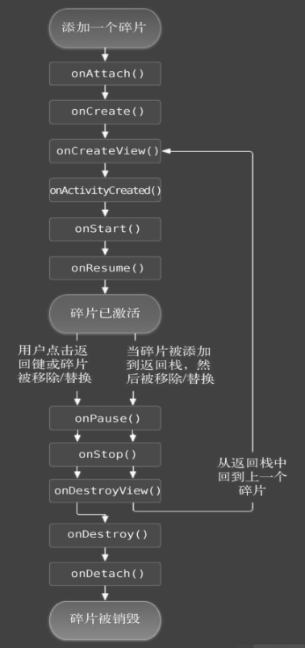
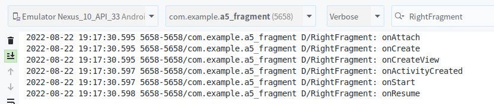
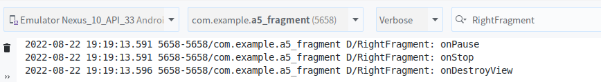
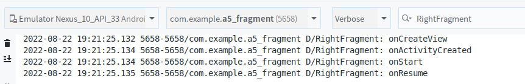
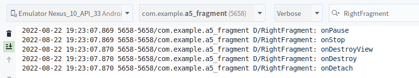
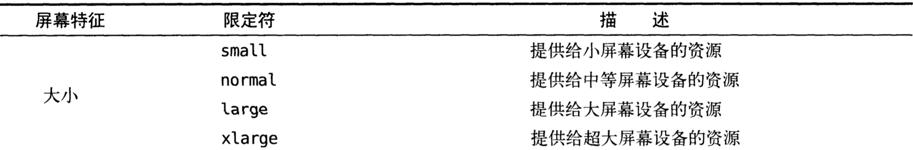
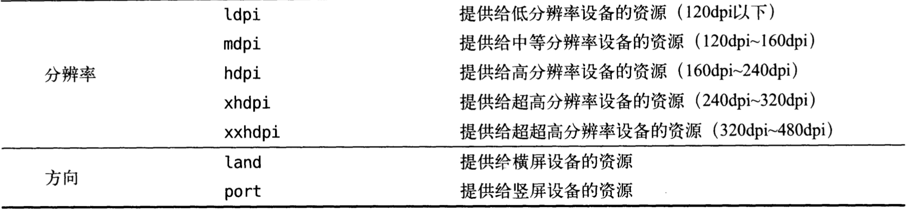

## 一. 碎片的概念

碎片(Fragment)是一种可以嵌入在活动中的 UI 片段，能让程序更加合理和充分地利用大屏的空间，在平板中应用十分广泛。

碎片与活动很像，同样能够包含布局，拥有自己的生命周期，可以理解为迷你型的活动。

## 二.碎片的使用

### 1. 动态加载碎片

**目标：** 在一个活动中添加两个碎片，并让这两个碎片平分活动空间。

**实现：**

1. 新建一个左侧碎片布局： `left_fragment.xml` ，布局中放置了一个按钮，居中显示。随后新建右侧碎片布局 `right_fragment.xml` ，将布局颜色设置为绿色，并放置了一个 `TextView` 用于显示文本。再创建碎片布局 `another_right_fragment.xml`，只是将背景设置为黄色。

   ```xml
   <!-- left_fragment.xml -->
   <?xml version="1.0" encoding="utf-8"?>
   <LinearLayout xmlns:android="http://schemas.android.com/apk/res/android"
       android:orientation="vertical"
       android:layout_width="match_parent"
       android:layout_height="match_parent">
   
       <Button
           android:id="@+id/button"
           android:layout_width="wrap_content"
           android:layout_height="wrap_content"
           android:layout_gravity="center_horizontal"
           android:text="Button"
           />
   </LinearLayout>
   
   <!-- right_fragment.xml -->
   <?xml version="1.0" encoding="utf-8"?>
   <LinearLayout xmlns:android="http://schemas.android.com/apk/res/android"
       android:orientation="vertical"
       android:background="#00ff00"
       android:layout_width="match_parent"
       android:layout_height="match_parent">
   
       <TextView
           android:layout_width="wrap_content"
           android:layout_height="wrap_content"
           android:layout_gravity="center_horizontal"
           android:textSize="20sp"
           android:text="@string/right_fragment"
           />
   </LinearLayout>
   
   <!-- another_right_fragment.xml -->
   <?xml version="1.0" encoding="utf-8"?>
   <LinearLayout xmlns:android="http://schemas.android.com/apk/res/android"
       android:orientation="vertical"
       android:background="#ffff00"
       android:layout_width="match_parent"
       android:layout_height="match_parent">
   
       <TextView
           android:layout_width="wrap_content"
           android:layout_height="wrap_content"
           android:layout_gravity="center_horizontal"
           android:textSize="20sp"
           android:text="@string/another_right_fragment"
           />
   </LinearLayout>
   ```

2. 创建对应的 Fragment 类。

```java
// LeftFragment.java
public class LeftFragment  extends Fragment {
    @Override
    public View onCreateView(LayoutInflater inflater, ViewGroup container, Bundle savedInstanceState) {
        View view = inflater.inflate(R.layout.left_fragment, container, false);
        return view;
    }
}

//RightFragment.java
public class RightFragment  extends Fragment {
    @Override
    public View onCreateView(LayoutInflater inflater, ViewGroup container, Bundle savedInstanceState) {
        View view = inflater.inflate(R.layout.right_fragment, container, false);
        return view;
    }
}

//AnotherRightFragment.java
public class AnotherRightFragment extends Fragment {
    @Override
    public View onCreateView(LayoutInflater inflater, ViewGroup container, Bundle savedInstanceState) {
        View view = inflater.inflate(R.layout.another_right_fragment, container, false);
        return view;
    }
}
```

3. 修改 `activity_main.xml` 内容，添加 `FrameLayout` 布局，在其中放入碎片。随后在代码中向 `FrameLayout` 里添加内容，从而实现动态添加碎片的功能。

```xml
<?xml version="1.0" encoding="utf-8"?>
<LinearLayout xmlns:android="http://schemas.android.com/apk/res/android"
    android:orientation="horizontal"
    android:layout_width="match_parent"
    android:layout_height="match_parent" >

    <fragment
        android:id="@+id/left_fragment"
        android:name="com.example.a5_fragment.LeftFragment"
        android:layout_width="0dp"
        android:layout_height="match_parent"
        android:layout_weight="1"
        />

    <FrameLayout
        android:id="@+id/right_fragment"
        android:layout_width="0dp"
        android:layout_height="match_parent"
        android:layout_weight="2"
        />
</LinearLayout>
```

4. 最后在 `MainActivity.java` 中添加内容，实现动态添加碎片。

```java
public class MainActivity extends AppCompatActivity implements View.OnClickListener {

    @Override
    protected void onCreate(Bundle savedInstanceState) {
        super.onCreate(savedInstanceState);
        setContentView(R.layout.activity_main);

        Button button = (Button) findViewById(R.id.button);
        button.setOnClickListener(this);
        //在此函数中动态添加 RightFragment 碎片
        //当点击button时，函数中的方法将右侧碎片替换成 AnotherRightFragment。
        replaceFragment(new RightFragment());
    }

    @Override
    public void onClick(View view) {
        switch (view.getId()) {
            case R.id.button:
                replaceFragment(new AnotherRightFragment());
                break;
            default:
                break;
        }
    }

    private void replaceFragment(Fragment fragment) {
        FragmentManager fragmentManager = getSupportFragmentManager();
        FragmentTransaction transaction = fragmentManager.beginTransaction();
        transaction.replace(R.id.right_fragment, fragment);
        transaction.addToBackStack(null);
        transaction.commit();
    }
}
```

从代码中体现出，动态添加碎片主要分为5步：

+ 创建待添加的碎片实例
+ 获取 `FragmentManager` ，在活动中可以直接通过调用 `getSupportFragmentManager` 方法得到。
+ 开启一个事务，通过调用 `beginTransaction()` 方法开启。

+ 向容器内添加或替换碎片，一般使用 `replace()` 方法实现，需要传入 id 和待添加的碎片实例。
+ 提交事务，调用 `commit()` 方法来完成。

### 2. 在碎片中模拟返回栈

如果在事务提交之前调用 `FragmentTransaction` 的 `addToBackStack()` 方法，可以接收一个名字用于描述返回栈的状态，一般传入 null 即可。

### 3.碎片与活动进行通信

虽然碎片都是嵌入在活动中显示的，但实际上它们的关系没有那么亲密。碎片和活动都是各自存在于一个独立的类中，它们之间并没有那么明显的方式来直接进行通信。主要方式如下：

+  `FragmentManager` 提供了一个类似于 `findViewById()` 的方法，用于从布局文件中获取碎片的实例。

  ```java
  RightFragment rightFragment = (RightFragment) getFragmentManager().findFragmentById(R.id.right_fragment);
  ```

+ 碎片可以通过调用 `getActivity()` 方法来得到和当前碎片相关联的活动实例。

  ```java
  MainActivity activity = (MainActivity) getActivity();
  ```


---

## 三.碎片的生命周期

### 1.碎片的状态与回调

+  **运行状态** ：

  + 当一个碎片是可见的，而且它所关联的活动正处于运行状态时，该碎片也处于运行状态。

+  **暂停状态** ：

  + 当一个活动进入暂停状态时（由于另一个未占满屏幕的活动被添加到了栈顶），与它关联的可见碎片就会进入暂停状态。

+  **停止状态** ：

  + 当一个活动进入停止状态时，与它相关联的碎片就会进入停止状态；

  + 或者通过调用 `FragmentTransaction` 的 `remove()` 、 `replace()` 方法将碎片从活动中一处，但如果在事务提交之前调用 `addToBackStack()` 方法，这时的碎片也会进入到停止状态。 

    > 总的来说，进入停止状态的碎片对用户来说是完全不可见的，有可能会被系统回收。

+  **销毁状态** ：
  + 当一个活动被销毁时，与它相关联的碎片就会进入销毁状态；
  + 或者通过调用 `FragmentTransaction` 的 `remove()` 、 `replace()` 方法将碎片从活动中一处，但如果在事务提交之前并没有调用 `addToBackStack()` 方法，这时的碎片也会进入到停止状态。 

`Fragment` 类中也提供了一系列回调方法，以覆盖碎片生命周期的每个环节。除了活动中有的回调方法，碎片还提供了一些附加的回调方法：

+  `onAttach()` ：当碎片和活动建立关联的时候调用
+  `onCreateView()` ：为碎片创建试图（加载布局）时调用
+  `onActivityCreated()` ：确保与碎片相关联的活动一定已经创建完毕的时候调用
+  `onDestroyView()` ：当与碎片相关联的视图被移除时调用
+  `onDetach()` ：当碎片和活动解除关联的时候调用

碎片完整的生命周期示意图如下所示：



### 2.体验碎片的生命周期

在 `RightFragment.java` 中重写调用函数，体验碎片的生命周期。

```java
public class RightFragment extends Fragment {
    public static final String TAG = "RightFragment";

    @Override
    public void onAttach(Context context) {
        super.onAttach(context);
        Log.d(TAG, "onAttach");
    }

    @Override
    public void onCreate(Bundle savedInstanceState) {
        super.onCreate(savedInstanceState);
        Log.d(TAG, "onCreate");
    }

    @Override
    public View onCreateView(LayoutInflater inflater, ViewGroup container, Bundle savedInstanceState) {
        Log.d(TAG, "onCreateView");
        View view = inflater.inflate(R.layout.right_fragment, container, false);
        return view;
    }

    @Override
    public void onActivityCreated(Bundle savedInstanceState) {
        super.onActivityCreated(savedInstanceState);
        Log.d(TAG, "onActivityCreated");
    }

    @Override
    public void onStart() {
        super.onStart();
        Log.d(TAG, "onStart");
    }

    @Override
    public void onResume() {
        super.onResume();
        Log.d(TAG, "onResume");
    }

    @Override
    public void onPause() {
        super.onPause();
        Log.d(TAG, "onPause");
    }

    @Override
    public void onStop() {
        super.onStop();
        Log.d(TAG, "onStop");
    }

    @Override
    public void onDestroyView() {
        super.onDestroyView();
        Log.d(TAG, "onDestroyView");
    }

    @Override
    public void onDestroy() {
        super.onDestroy();
        Log.d(TAG, "onDestroy");
    }

    @Override
    public void onDetach() {
        super.onDetach();
        Log.d(TAG, "onDetach");
    }
}
```

运行后观察logcat中的日志信息。



> 当 RightFragment 第一次加载到屏幕时，会依次调用上面显示的函数方法。
>
> 然后点击 LeftFragment 中的按钮，增加的日志信息如下：



> 由于 AnotherRightFragment 替换了 RightFragment， 此时 RightFragment 进入停止状态，因此上面显示的函数方法得以调用。
>
> 如果在替换时没有调用 `addToBackStack()` 方法，此时 RightFragment 会进入销毁状态， `onDestory()` 和 `onDetach()` 方法就会得到执行。
>
> 接着按下 Back 键， RightFragment 会重新回到屏幕，增加的日志信息如下所示。



> 由于 RightFragment 重新回到了运行状态，因此上面显示的函数方法得以调用。
>
> 再次按下 Back 键，退出程序，增加的日志信息如下所示。



> 退出程序时，会依次调用上面显示的函数方法。最终活动与碎片一起销毁。

---

## 四.动态加载布局的技巧

### 1. 使用限定符

在 Android 中往往通过使用限定符（Qualifiers）判断程序应该是使用双页模式还是单页模式。 Android 中常见的限定符可以参看下表。



### 2.使用最小宽度限定符

当我们希望可以更加灵活地为不同设备加载布局，不管它们究竟被系统认为是什么限定符，此时可以使用最小宽度限定符（Smallest-width-Qualifier）。

最小宽度限定符允许我们对屏幕的宽度指定为一个最小值（以 dp 为单位），然后以这个最小值为临界点，屏幕宽度大于这个值的设备就加载一个布局，屏幕宽度小于这个值的设备就加载另一个布局。


